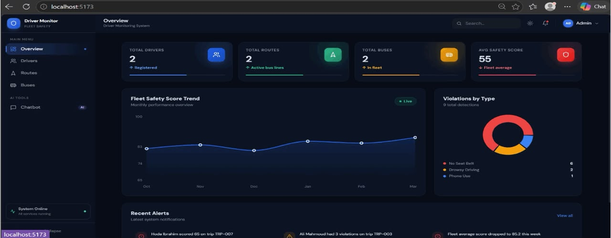
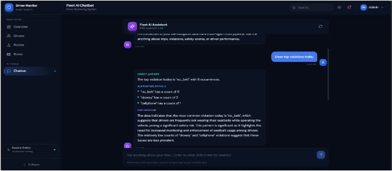
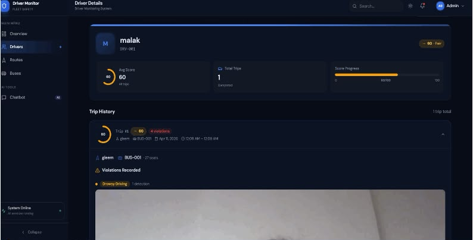
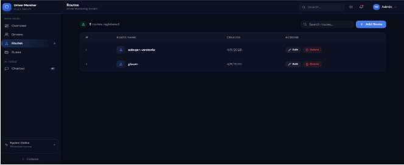
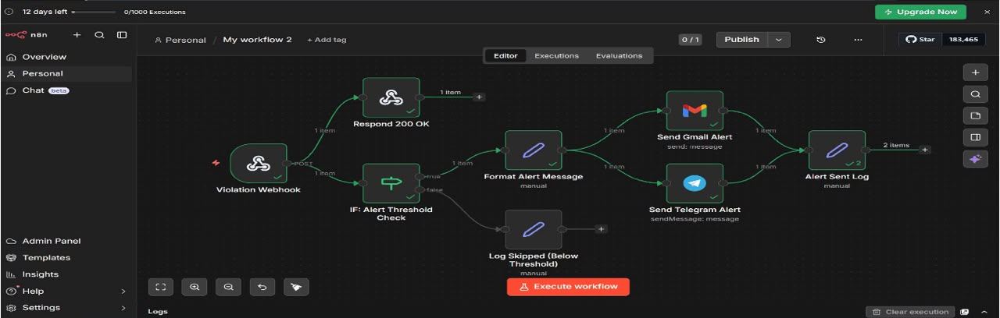

# 🚀 Automated Transit Safety Platform with RAG-Powered Analytics

<p align="center">
  
  
  
  
  
  
  
  
</p>

<p align="center">
  <b>An enterprise-grade, microservice-based Driver Monitoring System (DMS) designed to revolutionize transit and fleet safety.</b><br />
  Powered by real-time multi-model YOLOv8 computer vision, event-driven telematics, and Retrieval-Augmented Generation (RAG) for conversational safety analytics.
</p>

---

## 📸 Platform Showcase & Preview

| 📊 Fleet Overview & Real-Time Analytics | 🤖 Conversational AI Safety Agent (RAG) |
| :---: | :---: |
|  |  |
| *Real-time telemetry, live driver status, and comprehensive safety scoring across transit fleets.* | *Interactive natural language queries and automated reporting powered by Python and RAG.* |

| 👤 Driver Profiles & Trip Telematics | 🚌 Fleet Asset & Route Management |
| :---: | :---: |
|  |  |
| *Granular trip tracking, fatigue monitoring, and historical violation inspection per driver.* | *Seamless CRUD management and assignment for transit buses, routes, and active drivers.* |

### ⚡ Automated Alert Pipeline (n8n & Socket.IO)
<p align="center">
  
  <br />
  <i>Event-driven webhooks triggering instant emergency notifications and dispatch alerts upon real-time AI hazard detection.</i>
</p>

---

## 🔄 How It Works: End-to-End Operational Workflow

The platform operates as a continuous, closed-loop safety pipeline that captures live video, evaluates hazards in milliseconds, logs telematics, and dispatches emergency alerts without human intervention:

```
[ 📷 Webcam / Edge UI ]
         │ (Socket.IO Live Video Streaming at 15-30 FPS)
         ▼
[ 🌐 Webcam Backend Gateway ] ───(HTTP POST Multipart Frame)───► [ 🧠 Python AI Service (FastAPI) ]
         │                                                                  │
         │ (Returns Bounding Boxes & Confidence Metrics < 50ms) ◄───────────┘
         ▼
[ ⚖️ Cooldown & Rate-Limiting Engine ]
         │
         ├───► 💾 Annotates & Saves Proof Snapshot to Storage (sharp)
         ├───► 🗄️ Persists Violation Record in MongoDB Atlas (@dms/shared-models)
         ├───► ⚡ Emits Real-Time Dashboard Alarms via Socket.IO Channel (/ws/stream)
         └───► 🚨 Dispatches Webhook Payload to n8n Automated Emergency Workflows
```

1. **Edge Video Ingestion & Frame Capping:** The React streaming dashboard captures live webcam feeds and transmits optimized, compressed video frames over bi-directional **Socket.IO** WebSockets (`/ws/stream`) to the Node.js telematics gateway at a controlled rate of 15–30 FPS.
2. **Multi-Model YOLOv8 Inference:** The telematics gateway immediately dispatches frames via asynchronous HTTP connection pooling to the **FastAPI Python AI Engine**. Five dedicated PyTorch/YOLOv8 neural networks evaluate the frame simultaneously in memory to detect behavioral hazards (Smoking, Drowsiness, Seatbelt unfastened, Cellphone use, Hands-off steering wheel) with sub-50ms inference latency.
3. **Smart Event Cooldowns & Validation:** When an AI-detected hazard exceeds strict confidence thresholds (e.g., `DROWSY_EVENT_MIN_CONF > 0.35` or `CELLPHONE_EVENT_MIN_CONF > 0.40`), the gateway evaluates the event through an in-memory sliding window algorithm (`EVENT_COOLDOWN_MS`). This prevents alert flooding during prolonged violations while capturing high-resolution annotated proof snapshots using `sharp`.
4. **Automated Dispatch via n8n:** Verified violations are atomically written to **MongoDB Atlas** and trigger event-driven **n8n Webhook pipelines**, immediately notifying fleet supervisors via automated emails, SMS alerts, or emergency dispatch sirens.
5. **Conversational RAG Analytics:** Fleet managers can interrogate historical telematics using natural language (e.g., *"Which bus route had the most fatigue violations this week?"*). The Python **RAG Agent** retrieves relevant MongoDB documents, embeds them into vector context, and synthesizes executive safety reports using LLMs.

---

## 🧩 Microservice Components Deep-Dive & Technical Architecture

The codebase is structured as a decoupled **Monorepo Workspace** managed via NPM Workspaces (`package.json` workspaces), ensuring separation of concerns, shared dependency hoisting, and modular scalability across 5 specialized engineering layers:

### 1. 📁 `shared/models` (`@dms/shared-models`) — Centralized Data & Schema Layer
* **Architecture Pattern:** NPM Monorepo Hoisted Package (`package.json` with `"name": "@dms/shared-models"`).
* **Core Schemas & Validation:**
  * **`Driver.js`:** Enforces driver identities (`driverId`, `name`, `licenseNumber`, `assignedBus`, real-time `status` enum: `ACTIVE` | `OFF_DUTY` | `SUSPENDED`, and cumulative safety scores).
  * **`Trip.js`:** Tracks telemetry sessions, GPS routes, start/end timestamps, duration, and calculated fatigue score metrics.
  * **`Violation.js`:** Immutable hazard audit logs storing violation type (`SMOKING`, `DROWSY`, `CELLPHONE`, `NO_SEATBELT`, `HANDS_OFF`), AI confidence scores (`0.00 - 1.00`), exact bounding box coordinates `[x1, y1, x2, y2]`, and filesystem snapshot paths (`/snapshots/...`).
  * **`Bus.js` & `Route.js`:** Manages transit asset relations, license plates, passenger capacity, and scheduled stop coordinates.
* **Technical Advantage:** By exporting singleton Mongoose instances (`mongoose.model(...)`) and hoisting Mongoose as a root peer dependency, both Express backends share identical database validation rules and index constraints without schema drift or `"Cannot overwrite model once compiled"` runtime crashes.

### 2. 📁 `webcam-monitoring-app/ai-service` — Real-Time Computer Vision Inference Engine
* **Runtime & Stack:** Python 3.13, FastAPI, Uvicorn, PyTorch, Ultralytics YOLOv8, OpenCV (`cv2`), Starlette, NumPy.
* **Model Loader & Lifecycle (`app/inference/model_loader.py`):** On startup, an asynchronous lifecycle handler preloads 5 specialized `.pt` neural network weights into system memory for instant parallel execution:
  * `bestsmokeyolov8n.pt` — Optimized YOLOv8 Nano architecture for cigarette, vape, and smoke plume detection.
  * `bestyolov8drowsymodel.pt` — Specialized facial landmark and eye-closure neural network for fatigue and micro-sleep monitoring.
  * `bestbelt.pt` — Shoulder and lap seatbelt compliance verification model.
  * `bestcellphone.pt` — Object detection model trained on handheld mobile devices and phone-to-ear gestures.
  * `bestClass_v2.pt` — Steering wheel tracking model verifying two-handed driving compliance.
* **API Endpoints & Processing (`app/main.py` & `app/inference/predictor.py`):**
  * `POST /predict`: Accepts raw multipart video frames or Base64 image payloads. Executes OpenCV frame decoding (`cv2.imdecode`), runs parallel PyTorch tensor inference across active YOLO models, applies Non-Maximum Suppression (NMS) to eliminate duplicate bounding boxes, and returns a structured JSON payload containing coordinates, class labels, and confidence metrics in $< 50\text{ms}$.
  * `GET /health`: Real-time Kubernetes/Docker readiness probe reporting loaded model status, RAM utilization, and active inference hardware (CPU/CUDA GPU).

### 3. 📁 `webcam-monitoring-app/backend` & `frontend` — Live Telematics Gateway & Edge Streaming
* **Telematics Gateway (`backend/src/`):** Node.js + Express.js REST and WebSocket API running on Port `3001` (Docker Port `5000`).
  * **Bi-Directional WebSocket Streaming (`src/index.js` & `lib/socket.js`):** Establishes persistent Socket.IO WebSocket channels (`/ws/stream`). Receives live webcam frame bursts from edge devices and delegates inference requests to the Python AI Engine over HTTP connection pooling (`axios`).
  * **Smart Cooldown & Alert Throttling (`src/services/cooldownManager.js` & `alertService.js`):** Enforces an in-memory sliding window rate-limiting algorithm (`EVENT_COOLDOWN_MS`). Prevents alert flooding when a driver commits a prolonged hazard (e.g., holding a cellphone for 15 seconds registers 1 verified violation instead of 450 duplicate database entries).
  * **Snapshot Processing (`src/services/eventLogger.js`):** Uses the high-performance `sharp` image library to resize, compress, and save visual hazard evidence snapshots to local storage (`storage/snapshots/`) while persisting immutable records to MongoDB Atlas.
  * **Automated Webhooks Pipeline (`src/routes/alerts.js` & `docs/n8n-workflow.json`):** Atomically dispatches JSON event payloads containing violation metadata and snapshot proof links to external **n8n orchestration endpoints**, triggering automated dispatch emails, SMS sirens, and supervisor alarms.
* **Streaming Edge UI (`frontend/src/`):** React 18 + Vite dashboard running on Port `5174`. Features a low-latency HTML5 video canvas overlay (`WebcamMonitorPage.jsx`) that renders real-time AI bounding boxes, dynamic safety status cards (`StatusPanel.jsx`), and live audio alarm triggers upon hazard detection.

### 4. 📁 `dashboard/backend` & `frontend` — Enterprise Fleet Management Portal
* **Core API Server (`dashboard/backend/`):** Node.js + Express REST API running on Port `3000`.
  * **REST Endpoints (`routes/`):** Provides enterprise CRUD interfaces for `/api/drivers`, `/api/buses`, `/api/routes`, `/api/trips`, and `/api/violations`.
  * **Analytics & Aggregation Engine:** Executes complex MongoDB aggregation pipelines (`$lookup`, `$group`, `$match`, `$sort`) to calculate fleet-wide safety scores, driver fatigue indexes, route hazard distributions, and historical violation heatmaps.
* **Admin Analytics UI (`dashboard/frontend/`):** React 18 + Vite + Tailwind CSS dashboard running on Port `5173`.
  - **Executive Modules:** Includes `OverviewPage.jsx` (live KPI cards and telemetry charts), `DriversPage.jsx` & `DriverDetailsPage.jsx` (individual driver violation timelines, license details, and score badges), `BusesPage.jsx` & `RoutesPage.jsx` (fleet assignment and transit mapping), and `ViolationSlider.jsx` (visual inspection of historical hazard snapshots).

### 5. 📁 `dashboard/rag-agent` — Conversational AI Analytics & RAG Reporting Engine
* **Vector & LLM Stack (`rag-agent/`):** Built with Python 3.13, FastAPI (`server.py`), LangChain, and vector embeddings running on Port `8001`.
* **RAG Pipeline Architecture (`rag_pipeline.py` & `embedding_generator.py`):**
  * **Data Ingestion & Vectorization:** Continuously queries MongoDB for new driver trip logs, violation summaries, and safety scores, transforming structured telematics into dense semantic vector embeddings (`embedding_generator.py`).
  * **Natural Language Query Translation (`agents.py` & `generation.py`):** Enables fleet supervisors to ask natural language questions (e.g., *"Which transit bus route experienced the highest rate of driver fatigue during morning rush hour this month, and which drivers were involved?"*).
  * **Contextual Synthesis:** Retrieves relevant violation documents via vector similarity search and passes the enriched context to the LLM to generate actionable, executive-ready safety recommendations and automated compliance reports.

---

## 🛠️ Tech Stack & Technologies

- **Computer Vision & Machine Learning:** Python 3.13, Ultralytics YOLOv8, PyTorch, OpenCV, NumPy, FastAPI, Starlette, Uvicorn
- **Conversational AI & Analytics:** LangChain, RAG (Retrieval-Augmented Generation), Vector Embeddings, LLM Integration
- **Backend Infrastructure:** Node.js, Express.js, Socket.IO, Mongoose ORM, Sharp Image Processing, Axios Connection Pooling
- **Frontend User Interfaces:** React 18, Vite, Modern Responsive Design, Tailwind CSS, Custom Vanilla CSS
- **Database & Cloud Storage:** MongoDB / MongoDB Atlas, Local File Snapshot Caching
- **DevOps & Workflow Automation:** Docker, Docker Compose, NPM Monorepo Workspaces, n8n Webhook Pipelines

---

## 🚀 Getting Started

### Option 1: One-Click Docker Setup (Recommended)
Ensure Docker is running on your machine and your YOLO `.pt` model files are placed inside `webcam-monitoring-app/ai-service/models/`.

```bash
# Start MongoDB, AI Engine, Backends, and Frontends simultaneously
docker compose up --build
```
- **Admin Dashboard:** [http://localhost:5173](http://localhost:5173)
- **Live Webcam Monitor:** [http://localhost:5174](http://localhost:5174)

---

### Option 2: Local Development (Manual Setup)

**1. Bootstrap Workspace & Dependencies:**
```bash
# From project root — installs packages for all JavaScript services via NPM Workspaces
npm install
```

**2. Ensure Database is Online:**
Make sure a local MongoDB server is running on port `27017`, or configure your cloud `MONGO_URI` in the respective service `.env` files.

**3. Start the Microservices:**
Open separate terminal tabs from the root directory and launch each service:
```bash
# 1. Fleet Admin Backend
cd dashboard/backend && npm run dev

# 2. Fleet Admin Frontend
cd dashboard/frontend && npm run dev

# 3. Live Streaming Backend
cd webcam-monitoring-app/backend && npm run dev

# 4. Live Streaming Frontend
cd webcam-monitoring-app/frontend && npm run dev

# 5. Computer Vision AI Engine (FastAPI)
cd webcam-monitoring-app/ai-service
py -m pip install -r requirements.txt
py -m uvicorn app.main:app --host 0.0.0.0 --port 8000
```

---

## 📄 License
This project is licensed under the MIT License. Designed and engineered for high-reliability transit safety.
